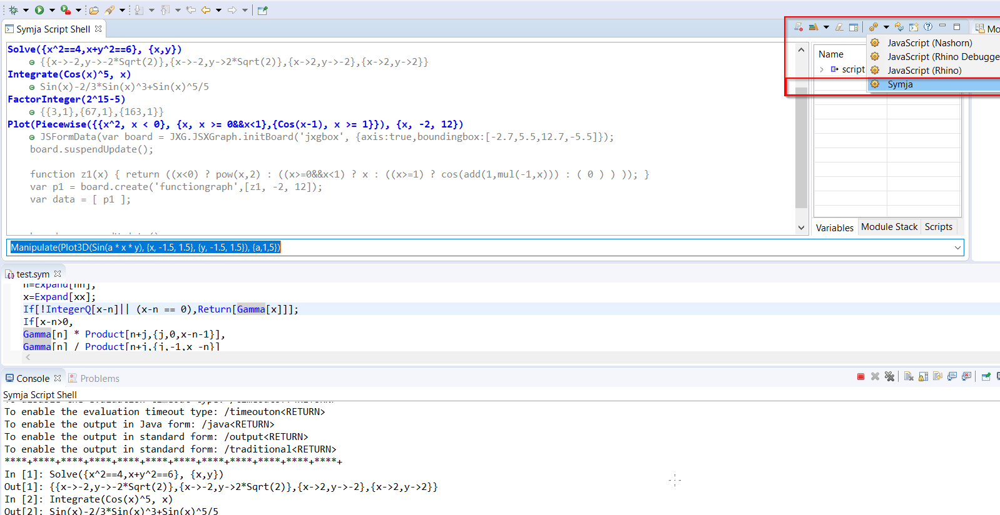
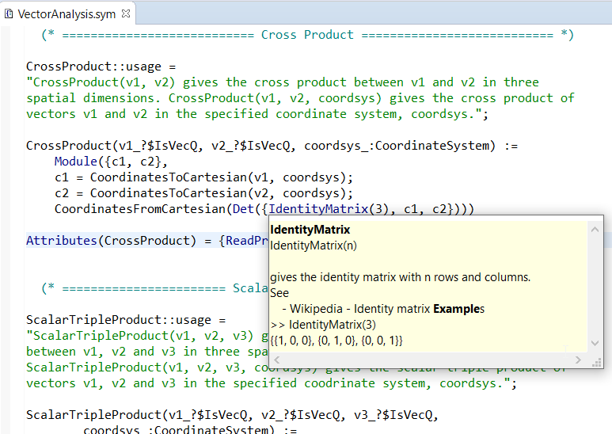

# Symja Eclipse EASE plugin
 
 
[Symja computer algebra language](https://github.com/axkr/symja_android_library) integration with [Eclipse EASE - scripting environment](https://www.eclipse.org/ease/) for the [Eclipse platform](https://www.eclipse.org/)
 
 ## Requirements
 
 This plugin requires the installation of 
 - the [Eclipse EASE - scripting environment](https://www.eclipse.org/ease/)
 - the [Eclipse Nebula - Supplemental Custom Widgets](https://www.eclipse.org/nebula/) especially the [Nebula NatTable - high performance SWT data grid](https://www.eclipse.org/nattable/)
 
 - an [example Github repository](https://github.com/axkr/symja_examples) contains some Symja example scripts.
 
 ## Usage
 
 ### Use Symja as a script shell
 
 
 
 ### Editor for Symja files
 
The `*.sym` file extension is mapped to the Symja editor

 
 
The Symja editor supports *content assist* (press `Ctrl+SPACE` after typing the beginning of a function), 
*syntax highlighting* and displaying *function documentation*
 
 
 
The `*.sym` file extension can also be started as a Symja Script (EASE Script) launch configuration.
The Script runs independent from the *Symja Script Shell* view

 
 
In the help pages you can find a *getting started* guide for the Symja language:

 